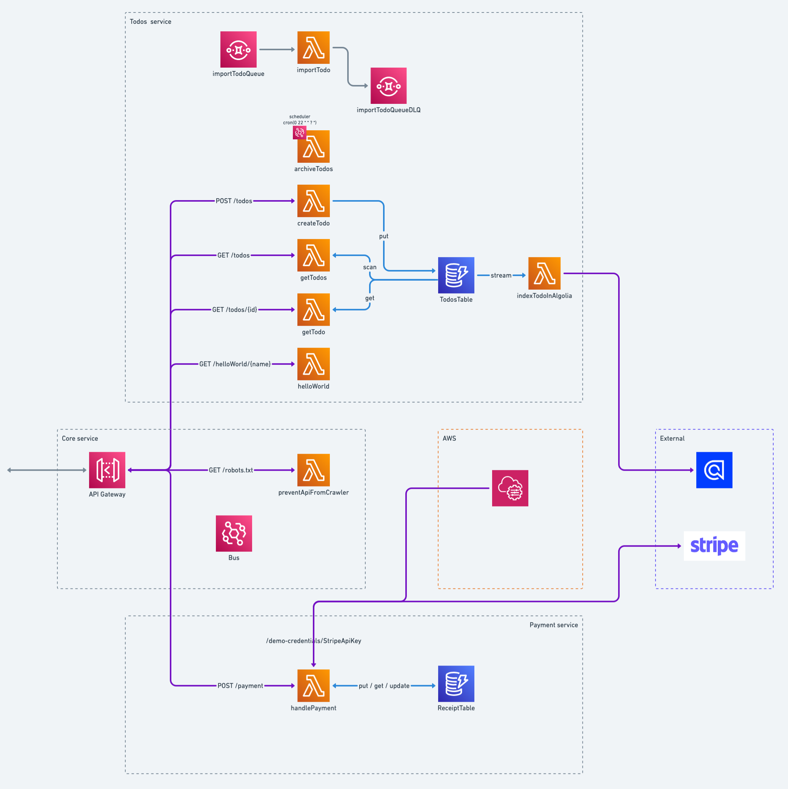

# Serverless demo

Used in this project:

- [Planity](https://www.planity.com/)
- [Serverless Framework](https://www.serverless.com/)
- [Typescript](https://www.typescriptlang.org/)
- [DynamoDB Toolbox](https://www.dynamodbtoolbox.com/) : Single Table Designs have never been this easy!
- [Middy middlewares](https://middy.js.org/) : The stylish Node.js middleware engine for AWS Lambda

## Stack architecture



## Prerequisites

Configure your profile in `~/.aws/credentials`.

Use it into `serverless.ts` :

```ts
custom: {
    environments: {
      dev: { profile: 'YOUR_PROFILE' },
    },
}
```

## Deploy

```bash
# deploy full stack
yarn serverless deploy

# deploy a specific function
yarn serverless deploy -f myFunction
```

## Invoke

```bash
# invoke a specific function locally using mock file
serverless invoke local -f helloWorld --path functions/helloWorld/handler.mock.json

# invoke a specific function on AWS using mock file
serverless invoke -f helloWorld --path functions/helloWorld/handler.mock.json
```

## Remove

```bash
# remove full stack
yarn serverless remove
```

## Useful resources

- [Slides - Serverless Framework Demo](./doc/serverless-framework-demo.pdf)

- [Serverless Land](https://serverlessland.com/)
- [Kumo](https://dev.to/kumo) : Experienced software developers building application using serverless services
- [sls-mentor](https://www.sls-mentor.dev/) : Open-source serverless infrastructure audit
- [SST](https://sst.dev/) : Build modern full-stack applications on AWS
